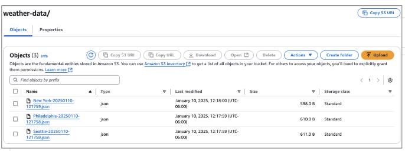
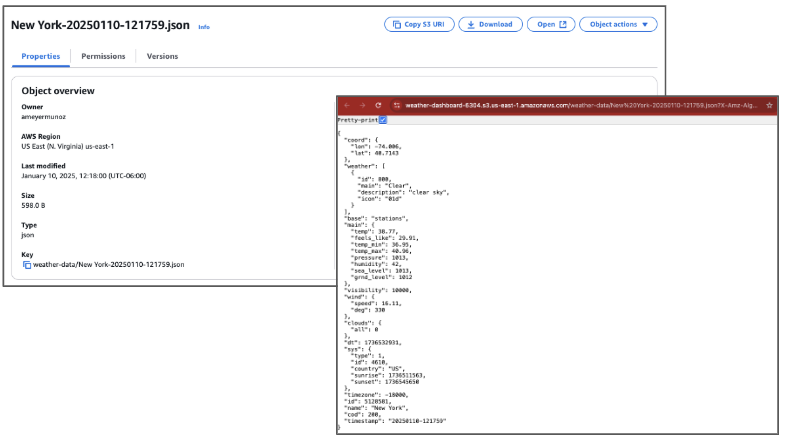

# Building a Weather Dashboard using AWS S3 and OpenWeather's API


I have officially joined the 30-Day DevOps challenge headed by the Cozy Cloud Crew! I'm joining a little later than planned but I'm excited to churn these challenges out and get to learning. 

If you are interested in joining, join the Discord sever [here](https://lnkd.in/gjBFNSwJ)!

The goal of this challenge is to better prepare for the job hunt.

## So what are we doing exacly?
I will be creating a weather data collection system that fetches real-time weather information from the OpenWeather API and stores it in an AWS S3 bucket. 

S3 is great for this exercise as it it can accomodate virtually an infinite amount of data, store that data in a secure fashion, is cost-effective, and easily integrates with other AWS services. 


## Project Structure

The project is organized as follows:
- `weather-dashboard`: Parent directory contaiting all project code and documentation.
- `src/`: Directory within `weather-dashboard` containing the source code for the weather data collection system.
- `tests/`: Directory within `weather-dashboard`, placeholder for unit tests.
- `data/`: Directory within `weather-dashboard`, used for storing collected weather data.
- `requirements.txt`: File listing the Python dependencies required for the project.
- `README.md`: File containing project documentation (this file). 
- `.env`: File within `weather-dashboard` that stores environment variables such as API keys and AWS credentials.

## Instructions

1. **Create parent directory**: `mkdir weather-dashboard`
2. **Create subdirectories**: `mkdir src tests data`
3. **Create `__init__.py` and `src/weather_dashboard.py` files within the `src` subdirectory**: 
  ```
   touch src/__init__.py
   src/weather_dashboard.py
   ```
   

Note that `__init__.py` will mark the src directory as a package and will help ensure compatibility if older Python versions are being used. On the other hand, the `weather_dashboard.py` file will contain the Python script that will do all of the fetching of weather data from the API. 

4. **Create `requirements.txt README.md .env` files**: `touch requirements.txt README.md .env`

The following steps will configure the .gitignore file to keep a clean and efficient version control system, that focuses on source code and essential files.

5. **Add** `.env` **file to .gitignore**: `echo ".env" >> .gitignore`
6. **Have git ignore files with** `.zip` **extension**: `echo "*.zip" >> .gitignore`

7. **Add ependencies to our** `requirements.txt` **file**: 
      ```
   echo "boto3==1.26.137" >> requirements.txt
      echo "requests==2.28.2" >> requirements.txt
      echo "python-dotenv==1.0.0" >> requirements.txt
   ```
   
8. **Configure AWS access**: Run `aws configure` and enter access keys.
9. **Create file that stores api key**: `echo "OPENWEATHER_API_KEY=your_api_key" >> .env`
NOte that this API key is generated once you create an account with [OpenWeather](https://openweathermap.org/api). 
10. **Create bucket stores api data**: `echo "AWS_BUCKET_NAME=weather-dashboard-${RANDOM}" >> .env`
* Ensure bucket creation by running `aws s3 ls`.
11. **Add python script to** `weather_dashboard.py`**file**: This code can be found in this repo. 
12. **Create a virtual environment to run python script**: 
`python3 -m venv .venv`

* I initally had problems getting my virtual environment to work. I dealt with that issue by recreating the environment using the following command: 
    ```
   rm -rf .venv
   ```
 
13. **Activate virtual env**: `source .venv/bin/activate`
* Before diving into installing your project's dependencies, it's a good idea to activate your virtual environment. This keeps your project's packages separate from the rest of your system, avoiding any mix-ups. I learned this after going around in circles...
14. **Install boto3 to virtual env**: `pip install boto3`
15. **Install all dependencies**: `pip install -r requirements.txt`
16. **Run python script**: `python3 "src/weather_dashboard.py"

`
Now, lets make sure the bucket we created is storing weather information correctly. For this, navigate to the console and inspect the objects within the bucket. You should have 3 objects, one with weather information for each of the cities specified in our script. 



Select an object and click Open. 



   
   
   


