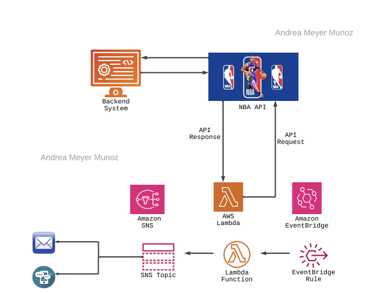

# Day 2 of the 30-day DevOpsAllStarChallenge - Game Day Notification Solution

The goal of this project is to automate the process of gathering game information by having AWS Lambda query an API, process the data, and schedule its delivery with EventBridge to our email or phone number via Amazon SNS. This solution will leverage serverless technology to simplify operations and ensure scalability. 

   
## Breakdown of Services Used
### 1. API

APIs act as intermediaries that help applications to communicate and exchange data. They receive requests, process them via a backend, and then return responses.

### 2. AWS Lambda
Lambda is one of AWS' serverless compute solutions. It lets us run code without having to worry about managing a server, which can be costly. In addition, this solution makes scalability possible if demand for game data were to suddenly increase. In this scenario, Lambda will run the code that will query our API, return a JSON response that will need to be translated into a human readable format to be sent to our email or phone number.

## 3. Amazon SNS (Simple Notification Service)
SNS will recieve data from Lambda and push notifications to endpoints (subscribers), which are a phone number and email in this case.

## 4. Amazon EventBridge
Now, we don't want to be bonmbarded by notifications ALL the time. instead, we will introduce some automation by using an EventBridge rule that will invoke our Lambda function to retrieve game data at specified intervals. This scheduling of a task is also known as a cron job. 

## Conclusion
Ultimately, all these services work together to automate the retrieval, processing, and delivery game data using serverless and cost-effecive solutions. Event-driven solutions like this one reduce manual effort and increase efficiency. 
